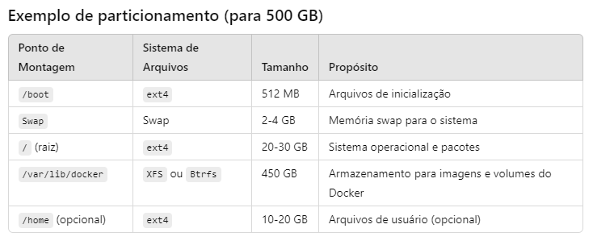

# Infraestrutura Servidor Debian 12 Bookworm

- Fazer a instalação do sistema e não habilitar o user root por motivos de segurança.
- Na sequência criar um usuário para fazer a administração.
- Fazer a configurações de rede **MANUAL**, pois e uma boa prática deixar o servidor com o **IP STATICO**.


## Particionamento do disco para melhor aproveitamento sem problemas de falta de espaço.



## Motivações para essa estrutura:
1. **Isolamento de dados Docker**: Colocar o diretório Docker em uma partição dedicada (/var/lib/docker) previne que o Docker ocupe todo o espaço disponível no sistema, o que poderia travar o servidor.

2. **Swap**: Uma partição de swap pequena previne problemas de falta de memória. O tamanho da swap pode ser ajustado dependendo da quantidade de RAM disponível.
3. **Facilidade de expansão e manutenção**: Ao separar diretórios críticos como /var, você pode expandir ou fazer backup de partições mais facilmente no futuro.

## Considerações Finais:
-  Se o seu servidor vai rodar contêineres pesados (**bancos de dados, serviços críticos**), prefira o sistema de arquivos **XFS** ou **Btrfs** para o diretório /var/lib/docker, pois oferecem melhor performance e funcionalidades avançadas (como snapshots).
-  Monitore o uso de disco e planeje aumentos futuros ou ajustes conforme o uso do servidor crescer.

###  <span style="color:red;">OBS.:</span> Após o particionamento, só finalizar a instalação do Linux.

# Rodar a atualização do sistema caso não tenha sido feita.

#### É uma boa prática manter seu sistema atualizado. Use os seguintes comandos para atualizar seus repositórios e pacotes:

```bash
sudo apt-get update -y
sudo apt-get upgrade -y
```
#### Agora vamos instalar o "Net-Tools" onde podemos consultar as configurações de rede organizadas:

```bash
sudo apt-get install net-tools -y
```
#### Para a consulta das configurações de rede organizadas execute o comando:

```bash
sudo ifconfig
```
#### Atualize novamente o sistema

```bash
sudo apt-get update -y
sudo apt-get upgrade -y
```
#### Agora vamos instalar o Screenfetch

- O Screenfetch é uma ferramenta de linha de comando que exibe informações concisas sobre o sistema operacional e o hardware do computador de forma visualmente agradável. Ele fornece um resumo das especificações do sistema, como distribuição Linux, versão do kernel, CPU, RAM e outras informações relevantes.

```bash
sudo apt install screenfetch
```
#### Agora que o “Screenfetch” está instalado, você pode testá-lo. Digite o seguinte comando e pressione Enter:

```bash
sudo screenfetch
```

